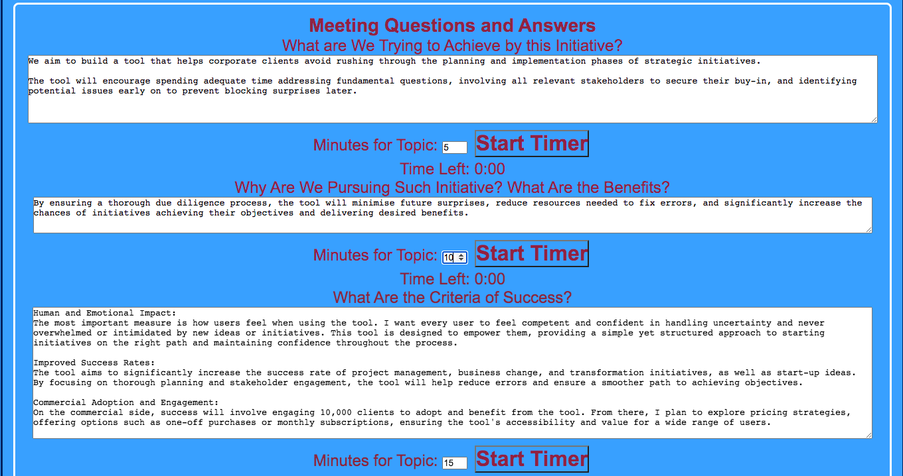
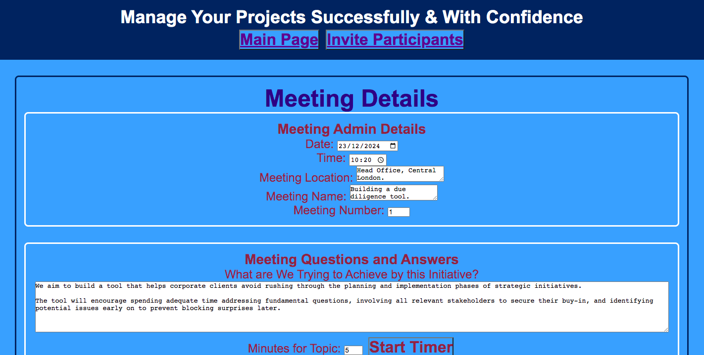

# Take Your First Steps Towards Successful Project Management
## Here is the link of the website as of Thursday the 24th of December 2024
https://path-hive.github.io/project3/

## Content
* [What I would like to achieve](#what-i-would-like-to-achieve)
* [Why](#why)
* [Target Audiance](#target-audiance)
* [Success Criteria](#success-criteria)
* [Stakeholders](#stakeholders)
* [Requirements](#Requirements)
* [Website Structure](#website-structure)
  * [Landing Page](#landing-page)
  * [Admin Page](#admin-page)
  * [Due Diligence Page](#due-diligence-Page)
* [Technologies Used](#technologies-used)
* [Validation](#validation)
* [Deployment](#deployment)
* [Future Adding](#future-adding)
* [Acknowledgement](#acknowledgement)
* [Git Used](#git-used)

## What I would like to achieve
I aim to build a tool that helps corporate clients avoid rushing through the planning and implementation phases of strategic initiatives. 

The tool will encourage spending adequate time addressing fundamental questions, involving all relevant stakeholders to secure their buy-in, and identifying potential issues early on to prevent blocking surprises later. 

*[Back to Content](#content)*
## Why

By ensuring a thorough due diligence process, the tool will minimize future surprises, reduce resources needed to fix errors, and significantly increase the chances of initiatives achieving their objectives and delivering desired benefits.

*[Back to Content](#content)*
## Target Audiance

My primary target audience is corporate clients, as the tool is designed to support their strategic initiatives effectively.

However, it is adaptable and can also benefit small start-up teams or even individuals with a dream they want to turn into reality. 

By guiding users through a structured process, stakeholder engagement, and due diligence, the tool helps ensure that initiatives, regardless of scale, have a solid foundation for success.

*[Back to Content](#content)*
## Success Criteria

1. Human and Emotional Impact:

The most important measure is how users feel when using the tool. I want every user to feel competent and confident in handling uncertainty and never overwhelmed or intimidated by new ideas or initiatives. This tool is designed to empower them, providing a simple yet structured approach to starting initiatives on the right path and maintaining confidence throughout the process.

2. Improved Success Rates:

The tool aims to significantly increase the success rate of project management, business change, and transformation initiatives, as well as start-up ideas. By focusing on thorough planning and stakeholder engagement, the tool will help reduce errors and ensure a smoother path to achieving objectives.

3.  Commercial Adoption and Engagement:

On the commercial side, success will involve engaging 10,000 clients to adopt and benefit from the tool. From there, I plan to explore pricing strategies, offering options such as one-off purchases or monthly subscriptions, ensuring the tool's accessibility and value for a wide range of users.

*[Back to Content](#content)*
## Stakeholders

- Dr. Muhammad Ali: Full Stack Software Development Bootcamp Tutor
- Dr. Ashraf Bocktor: Resposible for delivering the project
- Other participants of the Full Stack Software Development Bootcamp
- Clara Beckley: Bootcamp's first point of contact for career development
- Code Institute support team

*[Back to Content](#content)*
## Requirements

1. Basic README file
2. The web application must have content
3. The web application must be deployed
4. The deployment link must be added to README
5. The application must be responsive to various devices
6. The application must be accessible 
7. The application should have a basic user experience design
8. The code must be tested, specailly the Java Script part
9. It must include some Java Script interactive functionality
10. Write the git commands most often used

*[Back to Content](#content)*
# Website Structure
## Landing-Page
Provides a summary of the purpose of the tool and engages the user.

*[Back to Content](#content)*
## Admin Page
Prepares the first steps of the meeting to discuss the new initative by inviting the potential participants and providing them with the admin details of the meeting; such as the date and the time. 

*[Back to Content](#content)*
## Due Diligence Page
The questions to be answered are prepopulated on this page. The team works collaboratively to answer these questions. 

The meeting admin details are also captured for future reference. 

*[Back to Content](#content)*
## Features

1. On the admin page the user can add new participants and then add her/his contact details.

2. A basic Pdf is generated with the admin details of the meeting and the list of invited meeting participants. [View Sample PDF Feature](./assets/images/SamplePFDAdminDetailsSummary.png)

3. The topic of discussion was planned for 5 minutes. On start timer, it is showing that there are 4 minutes and 26 seconds left to conclude the discussion of that topic. 
[View Start Timer Feature](./assets/images/TimerForEachItemofDiscussion.png)

4. The user can add new stakeholder and then add his/her details. [View Add New Stakeholder Feature](./assets/images/SampleStakeholdersInfo.png)
    
5. The role of the stakholder can be selected from a pre-populated options of a drop down menu. [View role selection](./assets/images/DropdownMenu.png)

*[Back to Content](#content)*

## Technologies Used
- Frontend: HTML, CSS, JavaScript
- Version Control: Visual Studio, Git, GitHub

*[Back to Content](#content)*
## Validation

- For HTML, the following validator was used: [W3C Validator](https://validator.w3.org/nu/)

- For CSS, the following validator was used: [W3C CSS Validator](https://jigsaw.w3.org/css-validator/)

- For JavaScript, the following validator was used: [JSHint](https://jshint.com/).

*[Back to Content](#content)*
## Deployment
The project is deployed on the github pages and the link has been provided at the top of the readme. Here is the link once more

https://path-hive.github.io/project3/

*[Back to Content](#content)*
## Future Adding
1. User Interaction: Users add dynamic questions, allocate time, and fill in answers.
2. Data Storage: All inputs are saved in a backend database.
3. PDF and Emails: Generate a meeting summary PDF or send participant invitations.
4. AI Enhancement: Provide real-time AI suggestions for better outcomes.

*[Back to Content](#content)*

## Acknowledgement

- Miss. Jasmine Price: Full Stack Software Development Bootcamp Colleague for teaching me her code to create dynamic elements that inspired me to start on project 3 sooner than planned. I am also grateful to her for sharing with me the session storage idea to store the data.
- ChatGPT: For the code part to generate the PDF for the list of participants. 

- My December Hackathon Team: For introducing me to flask and mongodb to bring sooner my involvment of the backend that I will use to complete the future adding of this project.

- Special thanks to Vernell Clark the scrum master of the hackathons I took part in: For making me more fluent with git commands and to practically undestand about branching, pull and push requests.

- The code institute hackathon organisers: For organisaing such a well run activity. 

*[Back to Content](#content)*
 
## Git Used
1. Clone project3 from github to my local machine

       git clone https://github.com/PATH-HIVE/project3.git

2. Rename my folder in my local machine from project3 to improveproject3

3. Create a new repository in Github with the name improveproject3

4. Initiate a new local git repository 
 
        git init

5. Link to the remote repository in Github

       git remote add origin https://github.com/PATH-HIVE/improveproject3.git

6. Rename the default branch to main.

       git branch -M main

7. Verify the remote is set correctly

       git remote -v

8. Makes sure to update Updates the origin remote URL to point to the new repository (improveproject3) on GitHub.

       git remote set-url origin https://github.com/PATH-HIVE/improveproject3.git

9. Checks the status of the working directory and ensures everything is ready to be pushed.

       git status

10. Push local changes to the remote and set upstream. In this case pushes the whole code to the github repository as it was empty

        git push -u origin main 

11.  Create a new branch in github from the command line

         git branch ab-improveproject3-branch1

12. Switch to the new branch

        git checkout ab-improveproject3-branch1
13. Create branch and switch in one step 

        git checkout -b ab-improveproject3-branch1

14. Push the new branch to github

        git push -u origin ab-improveproject3-branch1
15. Check if the branch exists locally

        git branch

16. Check if the branch exists on GitHub

        git branch -r
17. Stage the changes

        git add readme.md

18. Commit the changes

        git commit -m "Update readme"

19. Push changes to the branch

        git push origin ab-improveproject3-branch1

20. For subsequent pushes to the same branch

        git push

21. For subsequesnt staging all changes

        git add .

- git pull origin main
- git add .
- git commit -m "Message Descripton"
- git push origin branch name//ab-project3-branch3
- git branch
- git checkout -b ab-project3-branch3
- git push --set-upstream origin ab-project3-branch3
- git stash
- git stash pop
- git fetch origin
- git branch -M main
- git push -u origin main
- git remote -v
- git remote set-url origin https://github.com/PATH-HIVE/project3.git
- git remote add origin https://github.com/PATH-HIVE/project3.git
- git push -u origin main
- git config --global user.email"...@..."
- git config --global user.name "...”
- git init -b main
- git branch -M main
- git pull --rebase origin main
- git clone https://github.com/PATH-HIVE/project3.git
- git status

*[Back to Content](#content)*